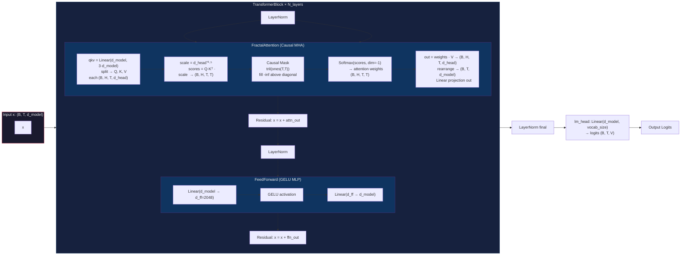
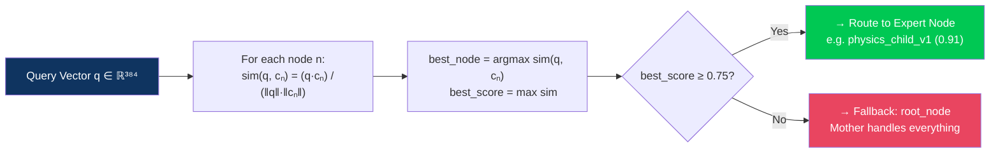
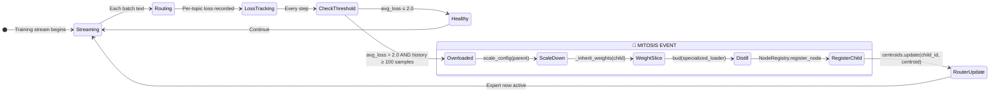
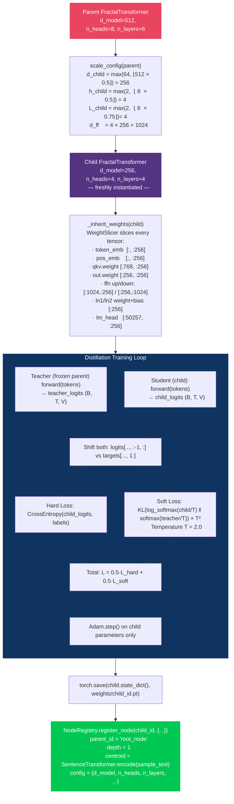
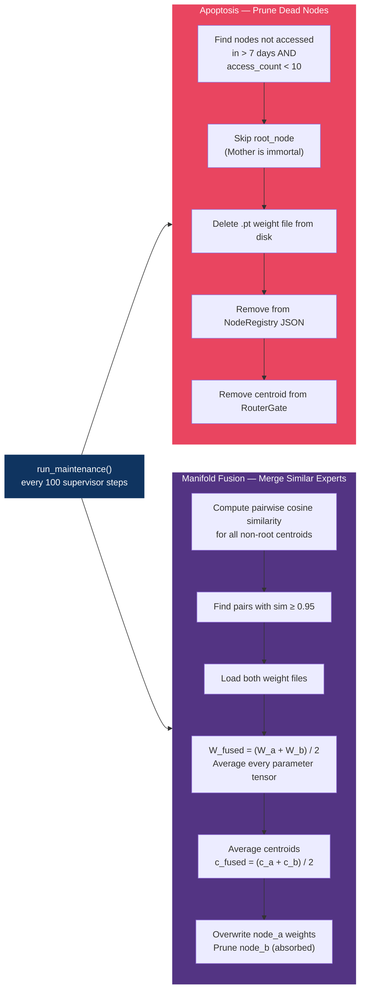

<div align="center">

```
██╗  ██╗ █████╗ ██████╗  █████╗ ███╗   ███╗   ██╗   ██╗ ██╗
██║ ██╔╝██╔══██╗██╔══██╗██╔══██╗████╗ ████║   ██║   ██║███║
█████╔╝ ███████║██████╔╝███████║██╔████╔██║   ██║   ██║╚██║
██╔═██╗ ██╔══██║██╔══██╗██╔══██║██║╚██╔╝██║   ╚██╗ ██╔╝ ██║
██║  ██╗██║  ██║██║  ██║██║  ██║██║ ╚═╝ ██║    ╚████╔╝  ██║
╚═╝  ╚═╝╚═╝  ╚═╝╚═╝  ╚═╝╚═╝  ╚═╝╚═╝     ╚═╝     ╚═══╝   ╚═╝
```

### **Fractal-Dendritic Network**
#### *A Self-Replicating, Biologically-Inspired Transformer Swarm*

[](https://opensource.org/licenses/MIT)
[](https://www.python.org/)
[](https://pytorch.org/)
[](https://huggingface.co/)
[](https://github.com)

[Architecture](#-architecture-overview) · [Training Pipeline](#-training-pipeline-the-awakening) · [Query Journey](#-query-journey-thought-to-token) · [Mitosis Engine](#-the-mitosis-engine-fractal-self-replication) · [Math](#-mathematical-foundations) · [Quick Start](#-quick-start)

---

> *"Most AI systems are buildings — static, pre-designed, immovable.*
> *KaramLLM is a forest. It begins as a single seed and grows its own structure in response to what it encounters."*

KaramLLM is a **Fractal-Dendritic Network (FDN)** — a living transformer swarm where a single Mother node seeds an ever-expanding tree of specialized expert nodes through biologically-inspired **Mitosis**. Each new node inherits intelligence from its parent via weight slicing and distillation, not random initialization.

---

</div>

---

## 🧭 Table of Contents

| Section | What You'll Learn |
|:---|:---|
| [System Overview](#-system-overview) | The 10,000-foot view of the entire organism |
| [Architecture Overview](#-architecture-overview) | All 5 subsystems and how they wire together |
| [Training Pipeline](#-training-pipeline-the-awakening) | Step-by-step: how the Mother comes alive |
| [Data Journey During Training](#-data-journey-during-training) | Exactly how tokens flow through the model |
| [Query Journey](#-query-journey-thought-to-token) | Every step from user input to response token |
| [Mitosis Engine](#-the-mitosis-engine-fractal-self-replication) | How and when the system self-replicates |
| [Immune System](#-the-immune-system-lifecycle-management) | Pruning, fusion, and node lifecycle |
| [Mathematical Foundations](#-mathematical-foundations) | All formulas, derived and explained |
| [Component Deep Dive](#-component-deep-dive) | Every class, every method, every contract |
| [Quick Start](#-quick-start) | Running it yourself |

---

## 🌌 System Overview

```
┌─────────────────────────────────────────────────────────────────────┐
│                       THE KARAM ORGANISM                            │
│                                                                     │
│   ┌──────────┐     ┌──────────────────────────────────────────┐    │
│   │  PRETRAIN │────▶│          NODE REGISTRY (JSON)            │    │
│   │  MOTHER   │     │   root_node → weights/root_node.pt       │    │
│   └──────────┘     └────────────────────┬─────────────────────┘    │
│                                         │                           │
│   ┌──────────────────────────────────────▼───────────────────────┐  │
│   │                  SUPERVISOR (Evolutionary Pressure)           │  │
│   │   Streams data → measures loss per topic cluster →           │  │
│   │   triggers MITOSIS when loss exceeds threshold                │  │
│   └──────────────────┬────────────────────────────────┬──────────┘  │
│                      │ Low Loss                        │ High Loss   │
│                      ▼                                 ▼             │
│              ┌──────────────┐               ┌────────────────────┐  │
│              │   Continue   │               │  BUD() → New Child │  │
│              │   Training   │               │  Distillation Loop │  │
│              └──────────────┘               └────────────────────┘  │
│                                                                     │
│   ┌─────────────────────────────────────────────────────────────┐   │
│   │                   INFERENCE SWARM (FastAPI)                  │   │
│   │                                                             │   │
│   │   User Query                                                │   │
│   │       │                                                     │   │
│   │       ▼                                                     │   │
│   │   [Semantic Router]  ──── encode → cosine sim ────▶ node_id │   │
│   │       │                                                     │   │
│   │       ▼                                                     │   │
│   │   [Model Swapper]    ──── load from disk ──────▶ model      │   │
│   │       │                                                     │   │
│   │       ▼                                                     │   │
│   │   [FractalTransformer] ── autoregressive decode ──▶ tokens  │   │
│   │       │                                                     │   │
│   │       ▼                                                     │   │
│   │   [FractalTokenizer]  ── decode ──────────────────▶ text    │   │
│   └─────────────────────────────────────────────────────────────┘   │
└─────────────────────────────────────────────────────────────────────┘
```

---

## 🏗️ Architecture Overview

The system is broken into **5 interdependent phases**, each with a clear biological analogy.

```mermaid
graph TB
    subgraph P1["Phase 1 · Genesis Node"]
        FC[FractalConfig<br/>DNA Blueprint]
        FT[FractalTransformer<br/>The Stem Cell]
        FA[FractalAttention<br/>Causal MHA]
        FF[FeedForward<br/>GELU MLP]
        WS[WeightSlicer<br/>DNA Transcription]
        FC --> FT
        FT --> FA
        FT --> FF
        WS -.->|slice| FT
    end

    subgraph P2["Phase 2 · Semantic Router"]
        VE[VectorEncoder<br/>all-MiniLM-L6-v2]
        CM[CentroidManager<br/>Expert Map]
        RG[RouterGate<br/>Cosine Threshold]
        VE --> RG
        CM --> RG
    end

    subgraph P3["Phase 3 · Mitosis Engine"]
        SP[FractalSupervisor<br/>Entropy Monitor]
        BUD[bud&#40;&#41;<br/>Distillation Loop]
        SP -->|High Loss| BUD
        BUD --> FT
    end

    subgraph P4["Phase 4 · Swarm Registry"]
        NR[NodeRegistry<br/>Family Tree JSON]
        LM[LifeCycleManager<br/>Immune System]
        NR --> LM
    end

    subgraph P5["Phase 5 · Hyper-Stream Runtime"]
        API[InferenceAPI<br/>FastAPI /generate]
        MS[ModelSwapper<br/>VRAM Manager]
        SA[StreamAggregator<br/>Ensemble Avg]
        API --> MS
        MS --> SA
    end

    FT -->|pretrain| NR
    BUD -->|register child| NR
    RG -->|route to| MS
    MS -->|load config from| NR
    SP -->|maintenance| LM

    style P1 fill:#1a1a2e,stroke:#e94560,color:#eee
    style P2 fill:#16213e,stroke:#0f3460,color:#eee
    style P3 fill:#0f3460,stroke:#533483,color:#eee
    style P4 fill:#533483,stroke:#e94560,color:#eee
    style P5 fill:#1a1a2e,stroke:#533483,color:#eee
```



### The Five Systems at a Glance

| Phase | System | File | Biological Role |
|:---:|:---|:---|:---|
| 1 | **Genesis Node** | `src/models/fractal_transformer.py` | *Stem Cell* — a variable-size transformer that is the DNA unit of the entire swarm |
| 2 | **Semantic Router** | `src/router/semantic_router.py` | *Hippocampus* — converts queries to vectors, routes to the best-fit expert |
| 3 | **Mitosis Engine** | `src/training/supervisor.py` | *Evolutionary Pressure* — detects knowledge saturation, triggers reproduction |
| 4 | **Swarm Registry** | `src/registry/` | *Nervous System* — tracks every node's lineage, config, centroid, and file path |
| 5 | **Hyper-Stream** | `src/runtime/` | *Muscles + Reflexes* — loads/unloads models and serves inference in real time |

---

## 🔥 Training Pipeline: The Awakening

### What happens when you run `pretrain_mother_node()`

```mermaid
flowchart TD
    A([🚀 python pretrain_mother.py]) --> B

    B["⚙️ Environment Setup
    PYTORCH_MPS_HIGH_WATERMARK_RATIO = 0.0
    Device: MPS → CUDA → CPU"]

    B --> C["🧠 FractalConfig Initialized
    d_model=512 · n_heads=8 · n_layers=6
    d_ff=2048 · vocab=50257 · ctx=512
    ~85M parameters"]

    C --> D["🔤 FractalTokenizer
    HuggingFace GPT-2 tokenizer
    pad_token = eos_token (id=50256)"]

    D --> E["📚 StreamDataset
    roneneldan/TinyStories
    Streaming — no full download
    Filter: len > 15 chars
    Encode to seq_len+1 tokens"]

    E --> F{{"DataLoader
    batch_size=4
    Iterable (streaming)"}}

    F --> G["📦 Per-Batch Processing
    inputs  = batch[:, :-1]   ← tokens 0..T-1
    targets = batch[:, 1:]    ← tokens 1..T   (shift!)"]

    G --> H["⚡ Forward Pass
    FractalTransformer(inputs)
    → logits: (B, T, V)"]

    H --> I["📐 Loss Computation
    CrossEntropy over flattened logits vs targets
    loss = CE( logits.reshape(B·T, V), targets.reshape(B·T) )"]

    I --> J["🔙 Backward + Clip + Step
    loss.backward()
    clip_grad_norm_(model, 1.0)
    AdamW.step()"]

    J --> K{step % 50 == 0?}
    K -->|Yes| L["📊 Log: step, loss, avg_loss, ETA
    MPS cache flush + gc.collect()"]
    K -->|No| M{step >= 5000?}
    L --> M

    M -->|No| F
    M -->|Yes| N["💾 torch.save → weights/root_node.pt"]

    N --> O["📋 NodeRegistry.register_node
    Writes root_node entry to registry.json
    parent_id=None · depth=0 · status=active"]

    O --> P([✅ Mother Node Online])

    style A fill:#e94560,color:white,stroke:none
    style P fill:#00C853,color:white,stroke:none
    style H fill:#0f3460,color:white,stroke:none
    style I fill:#0f3460,color:white,stroke:none
```



### Why the data is shifted by 1

The model is trained with a **causal language modeling** objective. For a sequence of tokens $[t_1, t_2, \ldots, t_T]$:

```
Input  tokens:  [ t₁  t₂  t₃  ...  t_{T-1} ]    ← what the model sees
Target tokens:  [ t₂  t₃  t₄  ...   t_T    ]    ← what it must predict
```

This forces next-token prediction at every position simultaneously. The shift is applied in `pretrain_mother.py`:

```python
inputs  = batch[:, :-1]   # drop last token
targets = batch[:, 1:]    # drop first token
```

---

## 🌊 Data Journey During Training

This is the complete path a sentence takes from raw text to gradient update.

```mermaid
sequenceDiagram
    participant DS as TinyStories Dataset
    participant SD as StreamDataset
    participant DL as DataLoader
    participant TK as FractalTokenizer GPT-2
    participant MDL as FractalTransformer
    participant LOSS as Loss Function
    participant OPT as AdamW Optimizer
    participant DISK as weights/root_node.pt

    DS->>SD: sample["text"] = "Once upon a time..."
    Note over SD: Filter: len(text) >= 15
    SD->>TK: encode(text, max_len=513)
    Note over TK: HuggingFace tokenizer, padding=max_length, truncation=True, tensor shape (1, 513)
    TK-->>SD: token_ids: (1, 513)
    Note over SD: Requires exactly 513 tokens<br/>to guarantee full-length batches
    SD->>DL: yield token_ids.squeeze(0) → (513,)
    DL->>MDL: batch: (4, 513)
    Note over MDL: inputs = batch[:,:-1] shape (4,512) | targets = batch[:,1:] shape (4,512)
    MDL->>MDL: token_emb(inputs) + pos_emb(positions)
    Note over MDL: x shape: (4, 512, 512)
    MDL->>MDL: x6 TransformerBlocks: LayerNorm+CausalMHA+Residual, LayerNorm+GELU FFN+Residual
    MDL->>MDL: lm_head(x) → logits (4, 512, 50257)
    MDL->>LOSS: logits.reshape(2048, 50257) vs targets.reshape(2048)
    LOSS->>OPT: scalar loss (cross-entropy)
    OPT->>MDL: gradient update (AdamW, lr=3e-4, wd=0.01)
    Note over OPT: clip_grad_norm_(model, 1.0)
    MDL->>DISK: torch.save(state_dict) every run end
```

---

## 🔭 Inside the FractalTransformer: Layer by Layer

Each of the 6 transformer blocks processes the sequence identically but independently. Here is what happens at every layer:



---

## 💬 Query Journey: Thought to Token

### Everything that happens when a user types a message

```mermaid
flowchart TD
    USR(["👤 User — Explain black holes"]) --> CC

    CC["chat_client.py
    POST /generate
    {text, max_len=50, temperature=0.8, top_k=50}"]

    CC --> API["FastAPI /generate endpoint
    src/runtime/inference_api.py"]

    API --> ROUTE["🧭 SemanticRouter.route(text)
    VectorEncoder encodes query
    → vector (384-dim, all-MiniLM-L6-v2)"]

    ROUTE --> CMP["CentroidManager
    Compare query vector vs all expert centroids
    via cosine similarity"]

    CMP --> GATE{confidence > 0.75?}

    GATE -->|No — no expert found| ROOT["Route to root_node
    (Mother, generalist)"]
    GATE -->|Yes — expert match| EXPERT["Route to physics_child_v1
    (Specialist)"]

    ROOT --> SWAP
    EXPERT --> SWAP

    SWAP["ModelSwapper.load_model(node_id)
    Read config from NodeRegistry
    Reconstruct FractalConfig
    torch.load(weights_path)
    model.eval()"]

    SWAP --> TOKENIZE["FractalTokenizer.encode(text, max_len)
    GPT-2 tokenizer
    → token_ids (1, T)
    Strip padding tokens (≠ pad_id)"]

    TOKENIZE --> GENLOOP

    subgraph GENLOOP["🔁 Autoregressive Generation Loop (max_len steps)"]
        direction TB
        G1["model(generated_so_far) → logits (1, T, V)"]
        G2["next_token_logits = logits[:, -1, :]  ← last position"]
        G3["Apply temperature: logits /= T"]
        G4["Apply repetition penalty: logits[seen] /= 1.1"]
        G5["Top-K filter: keep top 50 logits"]
        G6["Softmax → probabilities"]
        G7["Multinomial sample → next_token_id"]
        G8{token == EOS or PAD?}
        G9["Append next_token to generated sequence
        generated = cat([generated, next_token], dim=1)"]
        G1 --> G2 --> G3 --> G4 --> G5 --> G6 --> G7 --> G8
        G8 -->|Yes — stop| GX([Exit loop])
        G8 -->|No — continue| G9 --> G1
    end

    TOKENIZE --> GENLOOP
    GENLOOP --> DECODE["FractalTokenizer.decode(generated_ids)
    skip_special_tokens=True"]

    DECODE --> RESP["GenerateResponse
    { node_id, confidence, decoded_text }"]

    RESP --> DISP["chat_client.py displays:
    🤖 AI (physics_child_v1 | 0.91 | 243ms): ..."]

    style USR fill:#e94560,color:white,stroke:none
    style DISP fill:#00C853,color:white,stroke:none
    style GENLOOP fill:#1a1a2e,color:#eee,stroke:#533483
```



### The Routing Decision in Detail



---

## 🧬 The Mitosis Engine: Fractal Self-Replication

The most novel part of KaramLLM. When the ecosystem detects that the Mother is struggling with a specific topic cluster, it spawns a dedicated expert via **Knowledge Distillation**.

### When does Mitosis trigger?



### What `bud()` does internally



### The Fractal Tree — What It Looks Like After Growth

```
root_node  [depth=0, d_model=512, 8 heads, 6 layers]
│
├── science_child_1  [depth=1, d_model=256, 4h, 4L]
│   ├── physics_child_1  [depth=2, d_model=128, 2h, 3L]
│   └── biology_child_1  [depth=2, d_model=128, 2h, 3L]
│
├── code_child_1  [depth=1, d_model=256, 4h, 4L]
│   └── python_child_1   [depth=2, d_model=128, 2h, 3L]
│
└── medical_child_1  [depth=1, d_model=256, 4h, 4L]

Every node:  smaller, faster, more specialized than its parent.
Every node:  warm-started with the parent's knowledge.
```

---

## 🛡️ The Immune System: Lifecycle Management

KaramLLM does not grow forever unchecked. The `LifeCycleManager` acts as an immune cell, continuously running two operations:



---

## 📐 Mathematical Foundations

### 1 · Causal Self-Attention

For a sequence $x \in \mathbb{R}^{T \times d}$, projections split into $H$ heads each of size $d_h = d/H$:

$$Q, K, V = x W_Q,\; x W_K,\; x W_V \qquad W \in \mathbb{R}^{d \times d}$$

$$\text{Attention}(Q, K, V) = \text{softmax}\!\left(\frac{QK^\top}{\sqrt{d_h}} + M\right) V$$

where the causal mask $M_{ij} = 0$ if $j \le i$, else $-\infty$. This is implemented as:

```python
mask = torch.tril(torch.ones(T, T)).view(1, 1, T, T)
attn = attn.masked_fill(mask == 0, float("-inf"))
```

### 2 · Dimensional Scaling Laws (Mitosis Math)

Given parent config $C_p$ and decay rate $\lambda = 0.5$:

$$d_{child} = \max\!\left(64,\;\lfloor d_{parent} \cdot \lambda \rfloor\right) \quad\text{rounded to } h_{child}\text{-divisible}$$

$$h_{child} = \max\!\left(2,\;\lfloor h_{parent} \cdot \lambda \rfloor\right)$$

$$L_{child} = \max\!\left(2,\;\lfloor L_{parent} \cdot 0.75 \rfloor\right)$$

$$d_{ff\_child} = 4 \cdot d_{child}$$

The slower depth decay ($0.75$ vs $0.5$) is intentional: depth encodes sequential reasoning capacity which degrades faster than representational width.

### 3 · Weight Slicing (The Graft)

For any linear weight $W_p \in \mathbb{R}^{d_{out}^p \times d_{in}^p}$, the child is initialized as the top-left submatrix:

$$W_c = W_p\!\left[0:d_{out}^c,\; 0:d_{in}^c\right]$$

For embeddings (vocab $V$ is shared, only $d_{model}$ shrinks):

$$E_c = E_p\!\left[:,\; 0:d_{child}\right] \in \mathbb{R}^{V \times d_{child}}$$

### 4 · Knowledge Distillation Loss

The child learns simultaneously from hard ground-truth labels and from mimicking the teacher's probability distribution:

$$\mathcal{L}_{total} = \alpha \cdot \mathcal{L}_{hard} + (1 - \alpha) \cdot \mathcal{L}_{soft}$$

$$\mathcal{L}_{hard} = \text{CrossEntropy}\!\left(\hat{y}_{child},\; y_{true}\right)$$

$$\mathcal{L}_{soft} = T^2 \cdot D_{KL}\!\left(\log \sigma\!\left(\frac{z_c}{T}\right) \,\Big\|\, \sigma\!\left(\frac{z_t}{T}\right)\right)$$

with $\alpha = 0.5$, temperature $T = 2.0$ (softens the teacher's peaked distribution), and the $T^2$ factor restores gradient magnitude after temperature scaling.

Both $z_t$ and $z_c$ are **shift-aligned**: only positions $0..T-2$ predict tokens $1..T-1$.

### 5 · Routing via Cosine Similarity

For query $q \in \mathbb{R}^{384}$ and each expert centroid $c_n \in \mathbb{R}^{384}$:

$$\text{sim}(q, c_n) = \frac{q \cdot c_n}{\|q\| \cdot \|c_n\|}$$

$$\text{route}(q) = \begin{cases} \arg\max_n \;\text{sim}(q, c_n) & \text{if } \max_n \text{sim} \ge \tau \\ \text{root-node} & \text{otherwise} \end{cases}$$

with default threshold $\tau = 0.75$.

### 6 · Manifold Fusion (Weight Averaging)

For two nodes $a$ and $b$ whose centroids have $\cos(c_a, c_b) \ge 0.95$:

$$W_{fused} = \frac{W_a + W_b}{2}, \qquad c_{fused} = \frac{c_a + c_b}{2}$$

This is equivalent to **model merging** in the weight space — a practice that has been shown to combine complementary knowledge from models trained on overlapping distributions.

### 7 · VRAM Estimate

Before loading any node, memory footprint can be estimated as:

$$M_{bytes} \approx N_{params} \times 4 \quad \text{(float32)}$$

| Model Size | Params | VRAM |
|:---|:---:|:---:|
| Mother (d=512, L=6) | ~85M | ~340 MB |
| Child L1 (d=256, L=4) | ~22M | ~88 MB |
| Child L2 (d=128, L=3) | ~6M | ~24 MB |

---

## 🔬 Component Deep Dive

<details>
<summary><b>FractalTransformer — The Core Unit</b></summary>

**File:** `src/models/fractal_transformer.py`

| Method | Purpose | IO Contract |
|:---|:---|:---|
| `__init__(config)` | Build embedding, N×TransformerBlock, lm_head | Asserts `d_model % n_heads == 0` |
| `forward(tokens, targets?)` | Full forward pass + optional causal loss | In: `(B,T)` LongTensor · Out: `(B,T,V)` logits + optional scalar loss |
| `bud(loader)` | Spawn & distill a child node | In: iterable of `(tokens, targets)` · Out: smaller `FractalTransformer` in train mode |
| `_inherit_weights(child)` | Slice every weight from parent into child | Side effect: mutates child's parameters in place |

`TransformerBlock` = `LayerNorm → CausalMHA → residual → LayerNorm → GELU FFN → residual`

</details>

<details>
<summary><b>SemanticRouter — The Navigation System</b></summary>

**File:** `src/router/semantic_router.py`

| Class | Role |
|:---|:---|
| `VectorEncoder` | Lazy-loads `all-MiniLM-L6-v2` on first call. Encodes str or list[str] → float32 tensor on MPS/CPU |
| `CentroidManager` | Dict-backed store: `node_id → (384,) tensor`. Updated on every mitosis event |
| `RouterGate` | Computes cosine sim, applies threshold, returns `RouteResult(node_id, confidence, path)` |
| `SemanticRouter` | Composes all three. Single entry point: `router.route(text)` |

> **Cold-start caveat:** Centroids are in-memory only. After a server restart, no child nodes will be found until the supervisor re-registers them. This is a known architectural gap.

</details>

<details>
<summary><b>NodeRegistry — The Family Tree</b></summary>

**File:** `src/registry/node_registry.py`

Stores every node as a JSON entry. Example:

```json
{
  "root_node": {
    "parent_id": null,
    "depth": 0,
    "centroid_vector": [0.0, 0.0, ...],
    "file_path": "./weights/root_node.pt",
    "config": {"d_model": 512, "n_heads": 8, "n_layers": 6, "vocab_size": 50257, "d_ff": 2048},
    "status": "active"
  },
  "physics_child_1": {
    "parent_id": "root_node",
    "depth": 1,
    ...
  }
}
```

Validation on `register_node`:
1. `parent_id` must exist in registry (or be `null`)
2. `file_path` must exist on disk

</details>

<details>
<summary><b>InferenceAPI — The Public Face</b></summary>

**File:** `src/runtime/inference_api.py`  
**Endpoint:** `POST /generate`

```
Request:  { "text": str, "max_len": int=64, "temperature": float=0.8, "top_k": int=50 }
Response: { "node_id": str, "confidence": float, "decoded_text": str }
```

**Generation strategy:** Temperature-scaled top-K sampling with repetition penalty (÷1.1 per seen token). EOS/PAD token terminates generation. No beam search — designed for low-latency streaming.

</details>

---

## 📂 Repository Structure

```
karamLLM/
│
├── src/
│   ├── models/
│   │   └── fractal_transformer.py   ← The entire neural architecture
│   │
│   ├── router/
│   │   └── semantic_router.py       ← VectorEncoder + CentroidManager + RouterGate
│   │
│   ├── registry/
│   │   ├── node_registry.py         ← JSON persistence for node metadata
│   │   └── lifecycle_manager.py     ← Pruning + Fusion (the Immune System)
│   │
│   ├── runtime/
│   │   ├── inference_api.py         ← FastAPI /generate endpoint
│   │   ├── model_swapper.py         ← Load/unload models into device memory
│   │   └── stream_aggregator.py     ← Multi-expert logit averaging
│   │
│   ├── training/
│   │   ├── pretrain_mother.py       ← Phase 1: Train the root node on TinyStories
│   │   └── supervisor.py            ← Phase 3: Monitor + trigger Mitosis
│   │
│   ├── utils/
│   │   ├── device.py                ← MPS → CUDA → CPU device selection
│   │   ├── tokenizer.py             ← GPT-2 tokenizer wrapper (FractalTokenizer)
│   │   └── weight_slicer.py         ← Tensor slicing primitives for weight inheritance
│   │
│   ├── launch_swarm.py              ← Entry point: load registry → start FastAPI server
│   └── chat_client.py               ← Terminal chat interface
│
├── docs/
│   ├── architecture_specs.md        ← Dimensional specifications and hardware rules
│   ├── api_contracts.md             ← Method-level interface contracts
│   ├── phases.md                    ← 5-phase build blueprint
│   └── prompt_instructions.md       ← Coding standards and memory safety rules
│
├── weights/                         ← Trained .pt state dicts (git-ignored)
├── registry.json                    ← Live node family tree
└── requirements.txt
```

---

## ⚡ Quick Start

### 1 · Install

```bash
git clone https://github.com/fynq-ai/karamLLM.git
cd karamLLM
pip install -r requirements.txt
```

### 2 · Train the Mother Node

This streams TinyStories and trains for 5,000 steps (~85M parameter GPT-2 scale model).

```bash
PYTHONPATH=. python3 src/training/pretrain_mother.py
# Output: weights/root_node.pt + registry.json entry
```

### 3 · Launch the Inference Swarm

```bash
PYTHONPATH=. python3 src/launch_swarm.py
# Swarm listening on http://localhost:8000
```

### 4 · Chat

```bash
# New terminal
PYTHONPATH=. python3 src/chat_client.py
```

```
══════════════════════════════════════════
🛸 KARAM.v1 - FRACTAL SWARM CONSOLE
══════════════════════════════════════════
👤 YOU: What is a black hole?
   (Thinking...)
🤖 AI (root_node | 0.62 | 318ms): A black hole is a region of spacetime...
```

### 5 · Optional: Run the Supervisor (Enables Mitosis)

```bash
# Runs alongside the API to continuously evolve the swarm
PYTHONPATH=. python3 src/training/supervisor.py
```

---

## 📦 Requirements

```
torch>=2.1.0
einops
transformers>=4.36.0       # GPT-2 tokenizer
sentence-transformers       # all-MiniLM-L6-v2 router
fastapi
uvicorn
pydantic>=2.0
datasets                   # HuggingFace TinyStories streaming
requests                   # chat_client HTTP
```

---

## 🗺️ Research Directions & Open Problems

This project is a prototype of ideas worth exploring further:

| Question | Current State | Research Direction |
|:---|:---|:---|
| **Centroid Cold-Start** | Centroids are lost on restart | Persist centroids in `registry.json`; reload at launch |
| **Dynamic Routing** | Threshold is static (0.75) | Learned routing: train a small gating network |
| **Weight Averaging** | Simple arithmetic mean for fusion | Fisher-weighted merging, SLERP, or task arithmetic |
| **Continual Learning** | No forgetting protection | EWC (Elastic Weight Consolidation) on shared layers |
| **Depth-3+ Trees** | System supports it but untested at scale | Evaluate long-term lineage coherence |
| **Router Embeddings** | 384-dim vs model's 512-dim | Align centroid dimension to model embedding space |
| **Ensemble Inference** | `StreamAggregator` exists but unused | Study multi-expert logit fusion vs routing |

---

<div align="center">

---

```
Every query is a gift.
Every expert is a memory.
Every mitosis is growth.

— The Fractal Manifesto
```

**Built with obsession by [fynq.AI](https://fynq.ai)**

*"Intelligence is not a destination. It is a process that never ends."*

---

</div>
